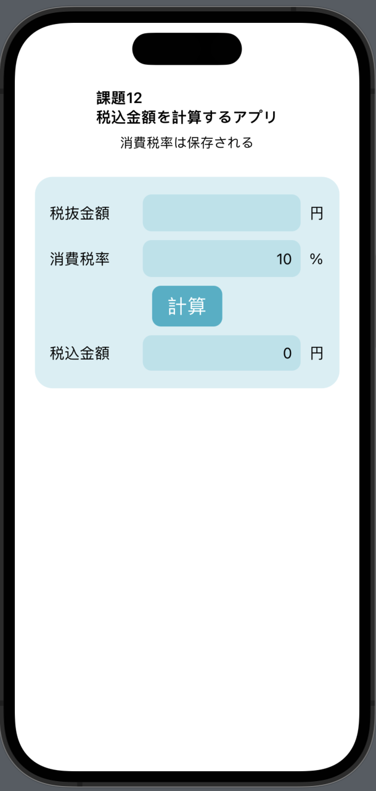

# 課題12 税込金額を計算するアプリ(消費税率は保存される)
<h2>Overview</h2>
<ul>
<li>税抜金額を入力し、税率を入力して計算ボタンを押すと、税込金額が表示される。</li>
<li>消費税率は保存される。</li>
</ul>

<h2>Memo</h2>
<ul>
<li>SwiftUI</li>
<li>@AppStrage</li>
<li>@State</li>
<li>Grid, GridRow</li>
<li>guard let</li>
<li>.modifier</li>
<li>.onAppear</li>
